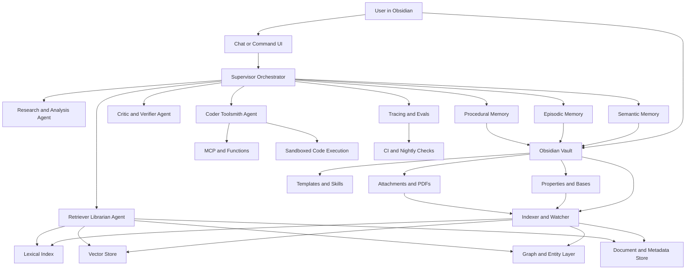
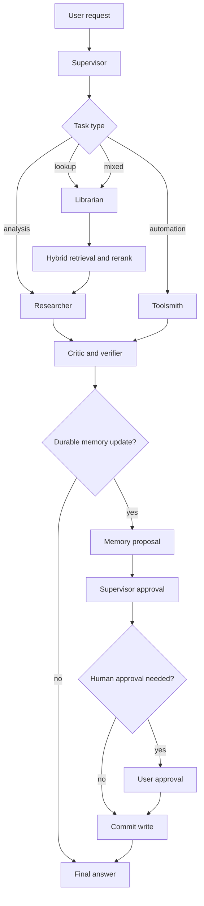

# Obsidian Multi-Agent Persistent AI Brain - Deep Research

> Imported research input used for Omar Brain v4. Preserve as evidence; it does not override the Brain Constitution automatically.

# Upgrading Obsidian into a Multi-Agent Persistent AI Brain

## Executive summary

The highest-lelihood-success path is **not** to turn Obsidian itself into the entire agent runtime. It is to use **Obsidian as the human-readable source of truth and control plane**—Markdown, properties, Bases, templates, operational notes, and procedures—while a separate retrieval and agent layer handles indexing, persistence, orchestration, code execution, and observability. That recommendation is strongly supported by the way Obsidian stores data locally in Markdown and properties, the fact that Bases is a database-like view over those files, the availability of plugin/API access to `Vault` and `MetadataCache`, and the existence of a secure Local REST API plugin with a built-in MCP server for automation and agent access. citeturn24view0turn24view1turn30view0turn24view2turn24view10

For memory, the most robust design is a **three-store model**. Keep **semantic memory** as canonical fact notes and entity pages in the vault; keep **episodic memory** as append-only execution journals, traces, and task logs; keep **procedural memory** as versioned skills, policies, templates, and SOPs in Markdown. This aligns with modern agent-memory taxonomies and with the way LangGraph and LangChain distinguish long-term memory types and persistence systems. citeturn38view8turn24view3turn23search0turn23search1

For retrieval, default to **hybrid search** rather than pure vector search: lexical search plus dense embeddings, followed by reranking. Official documentation from Pinecone, Weaviate, and Qdrant all supports hybrid approaches, and Anthropic’s contextual retrieval work shows that contextual embeddings plus contextual BM25 and reranking can materially reduce retrieval failures. Chunk by document structure first, then expand context after retrieval using parent/section expansion. citeturn38view1turn38view2turn33view4turn38view3turn38view4turn38view5turn38view6

For multi-agent systems, start simpler than most internet demos suggest. Anthropic explicitly advises that the most successful production systems use **simple, composable patterns** and only add complexity when necessary. In practice, the best architecture for an Obsidian AI brain is usually a **supervisor-orchestrator** plus a small set of specialists: planner, retriever/librarian, analyst/researcher, coder/toolsmith, and critic/verifier. Use workflows for predictable steps and agents only where model-driven flexibility is genuinely useful. citeturn27view0turn27view1turn25view0turn25view7turn26view0

On the stack side, a strong default is: **Obsidian + Bases + Dataview + Templater + Local REST API/MCP + Obsidian Git + Omnisearch + optional Smart Connections/Copilot UI**, then **LangGraph or OpenAI Agents SDK** for orchestration, **Qdrant** for a self-hostable vector layer, **Ollama or LM Studio** for local models, one strong hosted reasoning model for hard tasks, and **LangSmith or Arize Phoenix** for traces and evaluation. This gives you local-first control, clean swapability through MCP and OpenAI-compatible endpoints, and a path from prototype to production without binding your memory to any single plugin. citeturn18search16turn30view5turn30view6turn24view2turn30view3turn30view4turn30view9turn30view7turn24view8turn24view3turn33view1turn36view2turn36view4turn31view7turn31view8

The biggest operational risks are not “model intelligence.” They are **bad chunking, weak metadata, uncontrolled memory writes, insecure tool execution, stale embeddings, and lack of evaluation**. Obsidian local vaults are not encrypted by default; Qdrant self-hosted is not secure by default; and autonomous code agents need sandboxing. On the provider side, OpenAI API data is not used for training by default, and Anthropic commercial/API usage is not used for model training by default and can support zero data retention for eligible features, which matters when you decide what stays local versus what can safely go to hosted APIs. citeturn34view0turn33view0turn28view0turn28view1turn28view7turn28view8

## Foundational architecture and design principles

An Obsidian-based AI brain should have **four layers**. The first is the **authoring layer**: Markdown notes, attachments, YAML properties, links, Bases, and templates. The second is the **indexing and retrieval layer**: chunkers, embeddings, lexical indexes, vector stores, rerankers, and graph/entity indexes. The third is the **agent runtime**: orchestration, handoffs, tool use, memory policies, approvals, and code execution. The fourth is the **operations layer**: sync, versioning, access control, traces, evals, CI/CD, and migration. This layering matches both Obsidian’s local-file-first architecture and modern agent frameworks that separate state persistence from orchestration. citeturn24view0turn35view0turn30view0turn24view3turn31view4

The most important architectural rule is this: **Obsidian is the canonical human interface, not the only storage engine**. Bases already gives you database-like views over note properties, and Properties are structured YAML attached to notes. Dataview provides a high-performance live index and query engine over vault metadata. Those are ideal for human curation, dashboards, and policy inspection, but they are not by themselves a production retrieval engine for dense vectors, reranking, or multi-agent state recovery. citeturn24view0turn24view1turn35view0turn30view5turn24view3

A practical target architecture looks like this:



The second rule is **write control**. Only one role should be allowed to commit durable semantic or procedural changes. In practice, that means the orchestrator may propose memory updates, but a dedicated **memory curator** or validation gate commits them. This is an inference from production agent guidance emphasizing transparency, evaluation, predictable workflows, and human oversight for higher-stakes actions. citeturn27view1turn27view2turn27view3turn25view7

The third rule is **tool and interface standardization**. MCP matters because it provides a common protocol for exposing tools and data sources to LLM applications, and both Anthropic and OpenAI now surface MCP in their tool ecosystems. That makes it an excellent long-term interoperability strategy for an Obsidian brain that will likely evolve across models and frameworks. citeturn24view10turn37view0turn37view2

## Memory model inside Obsidian

A good memory system in Obsidian should make each memory type easy to inspect, diff, query, and re-index. Properties are stored in YAML and support structured values like text, links, dates, lists, numbers, tags, and booleans. Bases can then sort, filter, and edit those properties, while Dataview can query and aggregate them live. That makes Obsidian particularly well suited for durable semantic and procedural memory schemas. citeturn35view0turn24view0turn24view1turn30view5

### Semantic memory

Semantic memory should contain **stable facts, entities, preferences, summaries, and relationships**. In Obsidian, the right unit is usually a **canonical note** rather than a raw chunk. Use one note per entity, concept, project, source, or persistent user preference. Each note should contain a short canonical summary, aliases, links to evidence, provenance, update timestamps, and confidence. Since Bases supports note properties in frontmatter and file properties across file types, this pattern works well for both Markdown notes and linked attachment metadata. citeturn24view1turn35view0

Recommended layout:

- `/memory/semantic/entities/`
- `/memory/semantic/projects/`
- `/memory/semantic/preferences/`
- `/memory/semantic/summaries/`

Example semantic template:

```yaml
---
memory_type: semantic
entity_id: person_jane_doe
title: Jane Doe
aliases:
  - J. Doe
  - Jane A. Doe
entity_type: person
status: active
canonical: true
confidence: 0.86
sources:
  - [[Source - Meeting 2026-07-01]]
  - [[Email - 2026-06-28 Jane Budget]]
derived_from:
  - [[Episode - task_2026-07-01_1430]]
  - [[Episode - task_2026-06-28_0910]]
updated_at: 2026-07-07T13:25:00+02:00
review_by: 2026-08-01
tags:
  - memory/semantic
  - entity/person
---
# Jane Doe

## Canonical summary
Jane Doe leads finance review for Project Atlas and prefers weekly written updates.

## Stable facts
- Role: Finance reviewer
- Project: [[Project Atlas]]
- Preference: Weekly written updates on Fridays

## Open uncertainties
- Confirm escalation authority for vendor contracts
```

Rules for semantic writes:

- Only promote facts that are **stable enough to matter later**.
- Every fact must point to a **source note or episode**.
- Consolidate duplicates into one canonical note with `aliases`.
- Never store large quoted transcripts as semantic memory; store **distilled assertions** plus provenance.
- Re-review low-confidence facts on a schedule.

That policy is consistent with long-term memory guidance that separates facts from experiences and behaviors, and with research showing value in storing experience then reflecting into higher-level summaries. citeturn38view8turn23search0turn23search1

### Episodic memory

Episodic memory should be **append-only and event-shaped**: tasks attempted, tools used, query results, failures, corrections, user feedback, and final outcomes. This is the most important memory for debugging and continuous learning. LangGraph’s persistence is designed exactly for keeping information across runs, interruptions, and recovery, while observability platforms like LangSmith and Phoenix revolve around traces, steps, and evaluations. citeturn24view3turn31view7turn31view8

Recommended layout:

- `/memory/episodes/YYYY/MM/`
- `/logs/agent-runs/`
- `/evals/feedback/`

Example episodic template:

```yaml
---
memory_type: episodic
episode_id: task_2026-07-07_1325
thread_id: atlas_vendor_review
task_type: analysis
agents:
  - supervisor
  - librarian
  - analyst
  - critic
status: completed_with_warnings
started_at: 2026-07-07T13:25:00+02:00
ended_at: 2026-07-07T13:41:00+02:00
tools_used:
  - vault_search
  - vector_search
  - web_search
  - python
artifacts:
  - [[Report - Atlas Vendor Review]]
retrieval_keys:
  - atlas vendor
  - payment terms
  - jane doe
promote_to_semantic:
  - person_jane_doe
  - project_atlas_vendor_policy
confidence: 0.74
human_feedback: accepted_with_edits
tags:
  - memory/episodic
  - run/analysis
---
# Episode task_2026-07-07_1325

## Goal
Review recent vendor-payment notes and produce an action memo.

## Context loaded
- 7 semantic notes
- 14 chunks from vector retrieval
- 3 lexical hits

## Decisions
- Chose hybrid retrieval over vector-only because lexical exact terms mattered.
- Deferred memory promotion until critic approved.

## Outcome
Produced memo and marked two candidate semantic updates.

## Errors and lessons
- One chunk omitted payment threshold; parent expansion fixed it.
```

Rules for episodic writes:

- Always record **inputs, retrieval set, tools, outcome, and confidence**.
- Keep full traces elsewhere if needed, but create a **human-readable summary note** in Obsidian.
- Mark candidate semantic promotions instead of writing directly.
- Store user corrections explicitly; they are gold for future evals and skills.

### Procedural memory

Procedural memory is **how the system should behave**: prompts, workflows, policies, checklists, rubrics, tool documentation, and reusable skills. Anthropic’s recent agent guidance emphasizes tool documentation, transparency, and carefully designed agent-computer interfaces, while PydanticAI explicitly treats instructions, hooks, tools, and settings as reusable composable capabilities. citeturn27view1turn31view2

Recommended layout:

- `/system/skills/`
- `/system/policies/`
- `/system/prompts/`
- `/system/workflows/`

Example procedural template:

```yaml
---
memory_type: procedural
skill_id: skill_memory_write_policy
version: 1.2.0
owner: ai_ops
applies_to:
  - supervisor
  - librarian
approval: required_for_semantic_promotion
updated_at: 2026-07-07T13:00:00+02:00
tags:
  - memory/procedural
  - skill
---
# Memory Write Policy

## Intent
Control what becomes durable memory.

## Rules
1. Do not write semantic memory unless the fact is likely to matter in future tasks.
2. Every durable fact must cite a source note or episode.
3. Prefer updating an existing canonical note over creating a duplicate.
4. Low-confidence facts must be placed under Open uncertainties.
5. Procedural changes require critic review and human approval if they affect external actions.

## Tests
- Can the fact be tied to a source?
- Is it stable enough to survive a week?
- Would a future agent benefit from seeing it?
```

### Obsidian control surfaces for memory

Use **Bases** as your operational console. A Base over `/memory/semantic/` can show `entity_type`, `confidence`, `review_by`, and `updated_at`. A Base over `/memory/episodes/` can show recurring failures, tool usage, and promotion candidates. Because Bases is local-file-backed and Dataview queries indexed metadata, both remain transparent, inspectable, and Git-friendly. citeturn24view0turn24view1turn30view5

## Retrieval and indexing

A persistent AI brain lives or dies by retrieval quality. The default retrieval stack should be **multi-stage**:

1. **Metadata and lexical narrowing**
2. **Dense retrieval**
3. **Hybrid fusion**
4. **Reranking**
5. **Context expansion to parent sections or linked notes**

That design follows official hybrid-search patterns in Pinecone, Weaviate, and Qdrant, plus reranking guidance from Cohere and chunk-expansion guidance from Pinecone. citeturn38view1turn38view2turn33view4turn38view3turn38view4

### Chunking strategy

Chunk by *structure first*, not fixed size first. Cohere’s guidance explicitly distinguishes content-independent and content-dependent splitting, and Pinecone notes that post-retrieval chunk expansion is often needed because a relevant chunk may still need surrounding context. For an Obsidian vault, the best default is:

- split at headings first;
- keep bullets/checklists/code blocks intact;
- keep speaker turns intact in meeting transcripts;
- store parent-child relationships;
- expand one level upward on retrieval for answer generation. citeturn38view5turn38view4

A practical default for Markdown notes:

- chunk target: **400–900 tokens**
- overlap: **10–15%**
- hard boundaries: heading, callout, code fence, table, task list
- parent metadata: note path, heading path, block start/end, updated_at, tags, outbound links

Use **smaller chunks for retrieval, larger parents for generation**. That is a direct fit with parent expansion and reduces the classic tradeoff between precision and context starvation. citeturn38view4turn38view5

### Indexing strategy

Use a watcher or scheduled job to compute:

- content hash
- file path and note ID
- frontmatter properties
- heading tree
- backlinks/outlinks
- chunk embeddings
- lexical fields
- optional entity extraction

LlamaIndex’s ingestion pipeline is a strong fit here because transformations can be cached, and storage is explicitly separated into document stores, index stores, vector stores, graph stores, and chat stores. It also supports persisted ingestion caches and upsert strategies. citeturn31view5turn31view6turn22search2

Recommended metadata schema per chunk:

```yaml
doc_id: note://projects/atlas/vendor-review
chunk_id: note://projects/atlas/vendor-review#h2-payment-terms:0003
vault: main
path: projects/atlas/vendor-review.md
heading_path:
  - Vendor Review
  - Payment Terms
chunk_index: 3
start_token: 1280
end_token: 1720
tags:
  - project/atlas
  - vendor
links_out:
  - note://people/jane-doe
updated_at: 2026-07-07T12:44:00+02:00
git_commit: 7a4f2c1
memory_type: source_note
importance: 0.63
```

### Retrieval patterns to support

Use different retrieval strategies for different query classes:

- **Lookup questions**: hybrid search with lexical boost and metadata filters.
- **Concept synthesis**: hybrid + rerank + neighbor expansion.
- **Cross-note relationship questions**: GraphRAG or entity-graph traversal.
- **“What happened recently?”**: episodic log search with recency boost.
- **“How do we usually do this?”**: procedural memory first, then semantic exemplars.

GraphRAG is worth adding when your vault contains many people, projects, systems, and event links. Microsoft’s GraphRAG is explicitly designed to augment prompts using a knowledge graph plus community summaries, which is valuable for narrative private corpora like a long-running PKM vault. citeturn38view7

### Vector database comparison

| Option | Best fit | Strengths | Tradeoffs | Evidence |
|---|---|---|---|---|
| **Qdrant** | Strong default for self-hosted Obsidian AI brain | Local mode and self-hosting are easy; docs support indexing, quantization, multitenancy, hybrid queries, and zero-downtime embedding migration; payload indexes help filtered search. | Self-hosted deployments are **not secure by default** and must be hardened before production. | citeturn33view1turn24view5turn33view4turn33view0turn24view4 |
| **pgvector + Postgres FTS** | Lowest system count, SQL-heavy teams | Keeps vectors with relational data; supports HNSW and IVFFlat; Postgres gives full-text search, joins, ACID semantics, and mature ops. | You assemble more of the retrieval stack yourself; fewer purpose-built hybrid/RAG conveniences than specialist vector DBs. | citeturn20search0turn20search4turn33view5turn20search17 |
| **Weaviate** | Teams wanting open-source vector DB with built-in AI search features | Native hybrid search, alpha balancing between vector and keyword signals, reranking/RAG ecosystem, and strong multi-tenancy. | More infrastructure than pgvector; more platform surface area than a minimal local-first setup. | citeturn24view6turn38view2turn33view3 |
| **Pinecone** | Managed service, minimum ops | Fully managed/serverless, secure enterprise controls, strong hybrid-search guidance, good production ops story. | More vendor dependency; less attractive for strict local-first privacy. | citeturn12search3turn28view2turn38view1 |
| **Milvus** | Larger-scale or GPU-heavy vector workloads | Strong scale orientation and support for hybrid search across dense and sparse vectors. | Operationally heavier than Qdrant or pgvector for a personal AI brain. | citeturn12search21turn12search1turn12search5 |

### Retrieval checklist

A good Obsidian retrieval pipeline should do all of the following:

- preserve **note path, heading path, and backlinks** in metadata;  
- combine **lexical, vector, and metadata** filtering;  
- rerank the top candidate set before generation;  
- store the **original text in payload/document storage** so re-embedding is possible later;  
- support **incremental upserts and deletes** driven by file hashes;  
- maintain at least one **eval set** for retrieval precision and groundedness. citeturn38view1turn38view2turn38view3turn24view4turn32view0turn32view1

## Multi-agent orchestration and execution

The biggest mistake in this space is to jump immediately to large swarms. Anthropic’s production guidance is blunt: the best systems usually use **simple, composable patterns**, start with the simplest solution, and only add complexity when it improves outcomes. Use workflows where the path is predictable; use agents where the number of steps is open-ended and tool choice matters. citeturn27view0turn27view1

### Recommended role layout

For a personal AI brain, use these roles:

- **Supervisor**: plans, routes, enforces policies, owns final state.
- **Librarian**: handles retrieval, deduplication, and memory proposals.
- **Researcher/Analyst**: synthesizes answers from evidence.
- **Toolsmith/Coder**: runs code, transformations, automations, and repairs.
- **Critic/Verifier**: checks faithfulness, policy compliance, and memory promotion.

This maps cleanly onto supervisor patterns in LangGraph, multi-agent patterns in LangChain, and the kinds of specialized conversable agents described in AutoGen. citeturn25view0turn25view2turn26view0

### Orchestration patterns

Use three orchestration modes:

| Pattern | Use when | Why it works | Evidence |
|---|---|---|---|
| **Workflow chain** | Input-to-output path is fixed | More predictable and easier to test; ideal for note cleanup, ingestion, summarization, and memory consolidation. | citeturn25view7turn27view1 |
| **Supervisor with specialists** | Task needs routing among experts | Centralizes state and policy while keeping subagents simple. | citeturn25view0turn24view8turn31view0 |
| **Swarm/handoff** | Conversation should continue with whichever specialist is active | Useful for interactive sessions where the active specialist should retain short-term context. | citeturn25view2 |

Recommended default flow:



### Shared memory and conflict resolution

A multi-agent Obsidian brain needs explicit conflict rules. My recommended rules are:

- **single-writer rule** for semantic and procedural memory;
- **append-only rule** for episodic memory;
- **proposal-review-commit** for durable updates;
- **idempotent writes** with stable IDs;
- **compare-and-swap** semantics on canonical notes using `updated_at`, `version`, and content hash;
- **critic veto** if evidence is insufficient or contradictory.

These are implementation recommendations rather than a vendor feature list, but they are directly motivated by production agent guidance around transparency, evaluation, and human oversight, plus the failure modes of long-running multi-agent systems. citeturn27view1turn27view2turn24view3

### Framework comparison

| Framework | Strengths | Weaknesses | Best use here | Evidence |
|---|---|---|---|---|
| **LangGraph** | Strong statefulness and persistence; workflows and agents; good fit for long-running, memoryful systems. | Lower-level than “plug-and-play” agent wrappers. | Best overall default for a persistent Obsidian brain. | citeturn24view3turn25view7turn17search11 |
| **OpenAI Agents SDK** | Official support for tools, handoffs, guardrails, tracing, and sandbox execution; good if you want minimal orchestration code around OpenAI-compatible patterns. | Best fit when OpenAI is central to the stack. | Strong option if you are comfortable with hosted orchestration primitives. | citeturn24view8turn37view1 |
| **AutoGen** | Strong research lineage for conversable specialized agents; flexible interaction patterns with LLMs, humans, and tools. | More open-ended; easier to overbuild. | Useful for experimentation and dialogue-heavy specialist interactions. | citeturn26view0 |
| **CrewAI** | Explicit crews, flows, guardrails, memory, observability, and deployment story. | Heavier abstraction than LangGraph. | Good if you want opinionated multi-agent project scaffolding. | citeturn31view0 |
| **PydanticAI** | Strong typed outputs and composable capabilities; MCP support and approval hooks are attractive. | Newer fit for teams that want schema-first agent construction. | Strong for structured data extraction and policy-driven tools. | citeturn31view2 |
| **Haystack** | Excellent explicit pipelines and search-oriented composition. | Better for retrieval pipelines than for highly interactive personal swarms. | Good for retrieval-heavy backends and indexing flows. | citeturn31view3 |

### Example orchestrator prompt

```text
You are the supervisor for a persistent Obsidian-based AI system.

Your responsibilities:
- classify the user request;
- select the fewest agents necessary;
- require evidence-grounded retrieval for factual answers;
- prevent direct writes to semantic/procedural memory unless a memory proposal is produced;
- require critic review before durable memory commits;
- ask for human approval for external side effects, procedural changes, or low-confidence memory promotions.

When routing:
- librarian handles search, indexing, dedupe, and memory lookup;
- researcher synthesizes from retrieved evidence;
- toolsmith executes code, APIs, and file transforms in sandboxed tools only;
- critic checks faithfulness, policy, and memory worthiness.

Output a structured plan with:
task_type, selected_agents, retrieval_needed, write_intent, approval_needed, stopping_criteria.
```

### Example memory-write prompt

```text
You are the memory curator.

Decide whether the candidate information should be written as:
- semantic memory,
- episodic memory only,
- procedural memory,
- or rejected.

Write semantic memory only if it is stable, useful later, and supported by evidence.
Write procedural memory only if it changes how the system should behave repeatedly.
If uncertain, reject or mark for review.

Return JSON with:
decision,
memory_type,
target_note_id,
confidence,
reasons,
required_sources,
proposed_frontmatter,
proposed_markdown
```

## Integration, governance, and operations

### Obsidian connection patterns

There are three reliable ways to connect Obsidian to an external memory engine.

The first is the **plugin/API path**. Obsidian plugins can access the `Vault`, `Workspace`, and `MetadataCache`, including headings, links, embeds, tags, and blocks. That is ideal if you want a custom plugin or local background indexer inside the Obsidian environment. citeturn30view0

The second is the **automation/API path** via **Local REST API with MCP**. This plugin exposes a secure authenticated REST API and a built-in MCP server, which is one of the cleanest ways to let external agents read and write the vault without screen scraping. citeturn24view2

The third is the **filesystem watcher path**. Because Obsidian stores content in local Markdown files and `.base` definitions, an external watcher can observe the vault directory, compute hashes, and send changes into your indexing pipeline. Bases syntax and Properties ensure these files remain transparent and editable outside Obsidian. citeturn24view0turn24view1turn35view0

### Plugin comparison and priority list

| Plugin or core feature | Priority | Why it matters | Main tradeoff | Evidence |
|---|---|---|---|---|
| **Bases** | Essential | First-party database-like views over notes and properties; ideal for AI control panels and review queues. | Still a view layer, not your full retrieval backend. | citeturn24view0turn24view1 |
| **Properties** | Essential | Structured YAML metadata for memory schema, filters, and governance. | Nested property support is limited; bulk editing is limited in-app. | citeturn35view0 |
| **Dataview** | Essential | Live indexing/querying of vault metadata; scales to very large annotated vaults; perfect for dashboards and queues. | Intended for display/query, not authoritative editing. | citeturn30view5 |
| **Templater** | Essential | Automates note, memory, and workflow templates with variables and JavaScript. | Easy to create hidden complexity if templates proliferate. | citeturn30view6 |
| **Local REST API with MCP** | Essential | Best bridge to external agents, scripts, browser extensions, and MCP clients. | Adds a local service surface you must secure. | citeturn24view2 |
| **Obsidian Git** | Essential | Commit/pull/push, history, diffs, and scheduled sync inside the vault. | Mobile stability is weaker. | citeturn30view3 |
| **Omnisearch** | High | Fast relevance-weighted local search with OCR/PDF indexing to complement AI retrieval. | Separate index behavior from your vector layer. | citeturn30view4 |
| **Smart Connections** | High | Local semantic related-note discovery with local embeddings and no API key required by default. | Best as a companion UI, not your only retrieval engine. | citeturn30view9turn19search4 |
| **Copilot for Obsidian** | High | Mature in-vault AI UI with vault search, context processing, and agentic capabilities; emphasizes user control. | A UI/plugin layer, not a complete ops stack. | citeturn30view7 |
| **Text Generator** | Medium | Broad provider support including local models; useful for templated generation workflows. | More generation-oriented than orchestration-oriented. | citeturn30view8 |
| **Self-hosted LiveSync** | Conditional | Strong privacy/self-hosted sync path with E2E encryption and conflict handling. | Not compatible with official Obsidian Sync; more operational overhead. | citeturn34view4 |

### LLM and local-model integration

A flexible Obsidian brain should support **hosted models and local models**, with standardized tool interfaces. OpenAI supports function calling, built-in tools, remote MCP servers, and sandboxed code execution. Anthropic supports client and server tools, MCP connectivity, and explicit tool-choice control. Gemini supports function calling, grounding with Google Search, embeddings, and both implicit and explicit context caching. Ollama supports embeddings, tool calling, and OpenAI-compatible endpoints; LM Studio and vLLM also expose compatibility layers that make provider swapping much easier. citeturn25view4turn37view0turn25view6turn25view5turn16search0turn16search1turn28view5turn28view6turn36view0turn36view1turn36view2turn36view3turn36view4

### Provider comparison

| Provider | Best use | Standout capabilities | Main caveat | Evidence |
|---|---|---|---|---|
| **OpenAI API** | Hosted reasoning, tools, and code-heavy workflows | Function calling, built-in tools, remote MCP support, Agents SDK, Code Interpreter sandbox. | Hosted dependency; evaluate privacy/retention by feature. | citeturn25view4turn37view0turn37view1turn25view6turn28view0 |
| **Anthropic API** | Reliable tool-using agents with strong workflow guidance | Tool use model, MCP integration, strong production agent patterns, zero-data-retention options for eligible features. | As with any hosted API, feature-level retention rules matter. | citeturn25view5turn24view10turn28view1turn11search0 |
| **Gemini API** | Search-grounded and cache-aware workflows | Function calling, Google Search grounding, multimodal embeddings, implicit and explicit caching. | Best strengths may pull you toward Google’s ecosystem. | citeturn16search0turn16search1turn16search3turn28view5turn28view6 |
| **Ollama** | Private/local inference and embeddings | Local embeddings, tool calling, OpenAI-compatible endpoint. | Hardware and model quality constraints are your responsibility. | citeturn36view0turn36view1turn36view2 |
| **LM Studio / vLLM** | Local or self-hosted model serving with compatibility | Local server and compatibility endpoints; vLLM adds scale, autoscaling, load balancing, and observability. | More ops than a desktop local runner. | citeturn36view4turn36view3 |

### Security, privacy, encryption, and access control

Security should be designed as **local-first plus least privilege**.

Obsidian Sync supports end-to-end encryption and emphasizes that local vaults are **not** encrypted by Obsidian itself. If you keep sensitive memory locally, use operating-system or disk encryption in addition to any sync-layer encryption. If you use file recovery or local snapshots, remember those remain device-local. citeturn34view0turn34view1turn34view2turn34view3

If you self-host your vector layer, Qdrant explicitly warns that self-hosted open-source deployments are **not secure by default** and must be configured with authentication, TLS, network binding, and logging before production use. citeturn33view0

If you choose hosted APIs, OpenAI’s API data is not used to train models by default unless you opt in, and Anthropic says commercial/API data is not used for training by default and supports zero data retention for eligible features. That leads to a sensible policy: keep your most sensitive semantic and episodic memories local by default, and only send the **minimum needed context** to hosted models. citeturn28view0turn28view1turn11search0

For code execution, use actual sandboxing. OpenAI’s Code Interpreter runs in a sandboxed container/VM environment, and Docker Sandboxes isolates coding agents in microVM sandboxes with a separate kernel and proxied network controls. Still, Docker’s security model also warns that the shared workspace and allowed network channels remain risk surfaces, so approvals and network policies still matter. citeturn25view6turn28view7turn28view8

### Cost and latency tradeoffs

The main economic tradeoffs are straightforward:

- **Local lexical search** is cheapest and fastest but weakest semantically.
- **Dense retrieval** improves recall but adds embedding/indexing cost.
- **Hybrid + rerank** usually gives the best accuracy, but adds one more stage and some latency.
- **Hosted frontier models** maximize reasoning quality but cost more and add network latency.
- **Local models** improve privacy and cost control but require hardware and often underperform on hard orchestration. citeturn38view1turn38view2turn38view3turn36view0turn36view2

Use routing to control these tradeoffs. Anthropic explicitly recommends routing easy tasks to cheaper/faster models and hard tasks to stronger ones, and Gemini’s caching docs show how repeated context can be cached to lower cost and latency. citeturn27view1turn28view5turn28view6

## Recommended stack and roadmap

### Recommended default stack

If you want one concrete recommendation with high confidence, this is it:

| Layer | Recommendation | Why |
|---|---|---|
| **Authoring and control plane** | Obsidian, Properties, Bases, Dataview, Templater | Transparent local Markdown + structured metadata + dashboards. citeturn35view0turn24view0turn30view5turn30view6 |
| **Agent bridge** | Local REST API with MCP | Cleanest vault access path for external agents and scripts. citeturn24view2turn24view10 |
| **Local search UX** | Omnisearch, optional Smart Connections | Excellent complement to AI retrieval and human exploration. citeturn30view4turn30view9 |
| **Versioning and sync** | Obsidian Git; Obsidian Sync for convenience or LiveSync for self-hosted privacy | Git for auditability; Sync choice depends on privacy and ops appetite. citeturn30view3turn34view1turn34view4 |
| **Ingestion** | LlamaIndex ingestion pipeline | Good support for transformations, caching, storage separation, and persistence. citeturn31view5turn31view6 |
| **Vector layer** | Qdrant | Best balance of self-hosting, hybrid retrieval, migration support, and cost control. citeturn33view1turn33view4turn24view4 |
| **Orchestration** | LangGraph | Best fit for persistent stateful multi-step agents. citeturn24view3turn25view7 |
| **Hosted model** | One strong reasoning provider of your choice | Needed for hard planning, synthesis, and verification. citeturn25view4turn25view5turn16search0 |
| **Local model** | Ollama or LM Studio | Keeps private tasks local and enables provider portability. citeturn36view2turn36view4 |
| **Code execution** | Docker Sandboxes or provider sandbox tools | Safer automation and code-agent runtime. citeturn28view7turn28view8turn25view6 |
| **Observability and evals** | LangSmith or Phoenix | Trace agent steps, evaluate retrieval separately, and close the feedback loop. citeturn31view7turn31view8turn32view0turn32view1 |
| **CI/CD** | GitHub Actions | Natural fit for nightly reindex, evals, and regression gates. citeturn9search0turn9search8turn9search16turn32view1 |

### Implementation roadmap

**Phase one: vault hygiene and schemas**  
Estimated effort: **3–5 days**.  
Create folder conventions, memory templates, property names, canonical note IDs, Git repo, and Bases dashboards. Without this step, every later retrieval and agent problem gets harder. citeturn35view0turn24view0turn30view5turn30view6

**Phase two: indexing and retrieval backbone**  
Estimated effort: **5–8 days**.  
Stand up Qdrant or pgvector, implement watcher + ingestion pipeline, chunking, embeddings, and hybrid retrieval with reranking. Add metadata filters and parent expansion. Create an initial retrieval eval set. citeturn31view5turn38view1turn38view2turn38view3turn32view0

**Phase three: supervisor plus two specialists**  
Estimated effort: **4–7 days**.  
Start with supervisor, librarian, and researcher only. Do not add more agents until this stack is reliable. Add critic next, then toolsmith. This sequencing follows the simplest-first guidance from Anthropic and LangChain. citeturn27view0turn25view0turn25view7

**Phase four: durable memory workflows**  
Estimated effort: **3–5 days**.  
Implement proposal-review-commit flows, semantic promotion rules, episodic summaries, and procedural skill notes. Put Bases views over pending memory writes and review dates. citeturn24view0turn38view8turn24view3

**Phase five: tool use and safe code execution**  
Estimated effort: **4–7 days**.  
Add MCP tools, REST actions, code execution, and file manipulation—but with approvals and sandboxing from the start. citeturn24view10turn37view0turn25view6turn28view7turn28view8

**Phase six: observability, evals, and CI**  
Estimated effort: **4–6 days**.  
Instrument traces, build offline eval datasets, add GitHub Actions for nightly tests and regression thresholds, and sample production traces for new eval cases. Note that OpenAI’s Evals platform is being deprecated later in 2026, so I would not build your long-term evaluation practice around it. citeturn31view7turn31view8turn32view1turn32view2

**Phase seven: scale and migration hardening**  
Estimated effort: **3–6 days initially, then ongoing**.  
Implement blue-green or named-vector embedding migrations, backup/restore drills, namespace/tenant policies if needed, and staged rollouts for very large vault segments. citeturn24view4turn33view2turn33view3

### Migration and scaling strategy for large vaults

For a large vault, do not reindex everything in one blind pass. Migrate in waves:

- active notes and high-value folders first;
- semantic memory notes second;
- attachment OCR/PDF extraction third;
- archives last.

Use **content hashes** to avoid unnecessary re-embedding, and keep the original text in payloads or document stores so you can migrate to a new embedding model later. Qdrant’s blue-green and named-vector migration guidance is especially useful here. citeturn24view4turn31view5turn31view6

If your vault grows toward team-scale multiuser usage, Qdrant and Weaviate both have serious multitenancy stories. For a personal brain, however, that is usually overkill until you start separating personal, work, and shared knowledge spaces with different access policies. citeturn33view2turn33view3

### Example CI sketch

```yaml
name: ai-brain-nightly
on:
  schedule:
    - cron: "0 2 * * *"
  workflow_dispatch:

jobs:
  index-and-eval:
    runs-on: ubuntu-latest
    steps:
      - uses: actions/checkout@v4
      - name: Install deps
        run: |
          python -m pip install -U pip
          pip install -U llama-index qdrant-client langgraph
      - name: Incremental reindex
        run: python scripts/reindex_changed_notes.py
      - name: Run retrieval evals
        run: python scripts/eval_retrieval.py --fail-below 0.78
      - name: Run answer groundedness evals
        run: python scripts/eval_groundedness.py --fail-below 0.82
      - name: Publish report artifact
        run: python scripts/build_eval_report.py
```

This is conceptually aligned with GitHub Actions workflow automation and with LangSmith’s ability to run evaluations in CI workflows and fail builds on threshold drops. citeturn9search8turn9search16turn32view1

### Open questions and limitations

A few items are worth treating carefully rather than pretending they are settled.

The first is **how much of the runtime you really want inside Obsidian**. The evidence strongly supports Obsidian as source-of-truth and control plane, but there is no single official first-party “agent runtime” for the whole architecture; the best design still requires external components. citeturn24view0turn24view2turn24view3

The second is **which hosted model should be primary**. OpenAI, Anthropic, and Gemini all now have strong tool ecosystems, and the right answer depends on your privacy posture, tool needs, and local-vs-hosted mix. The safest approach is to engineer for swapability through MCP and OpenAI-compatible endpoints. citeturn37view0turn25view5turn16search0turn36view2turn36view4

The third is **how much graph retrieval you need**. GraphRAG is promising for linked, narrative corpora, but many personal vaults will get most of the benefit from excellent metadata, hybrid retrieval, and reranking before they need knowledge-graph construction. citeturn38view7turn38view6turn38view3

The fourth is **evaluation infrastructure over time**. OpenAI’s Evals platform is on a deprecation path in late 2026, so for long-term operations I would prioritize framework-agnostic tracing and evaluation systems such as LangSmith or Phoenix, plus your own datasets in CI. citeturn32view2turn31view7turn31view8

The most defensible practical conclusion is this: **build a local-first Obsidian memory layer, pair it with hybrid retrieval and a small supervisor-led agent team, and make every durable write observable, reviewable, and reversible**. That architecture is the best balance of capability, privacy, maintainability, and future model portability supported by the evidence above. citeturn24view0turn24view2turn27view0turn38view1turn24view4turn31view7
